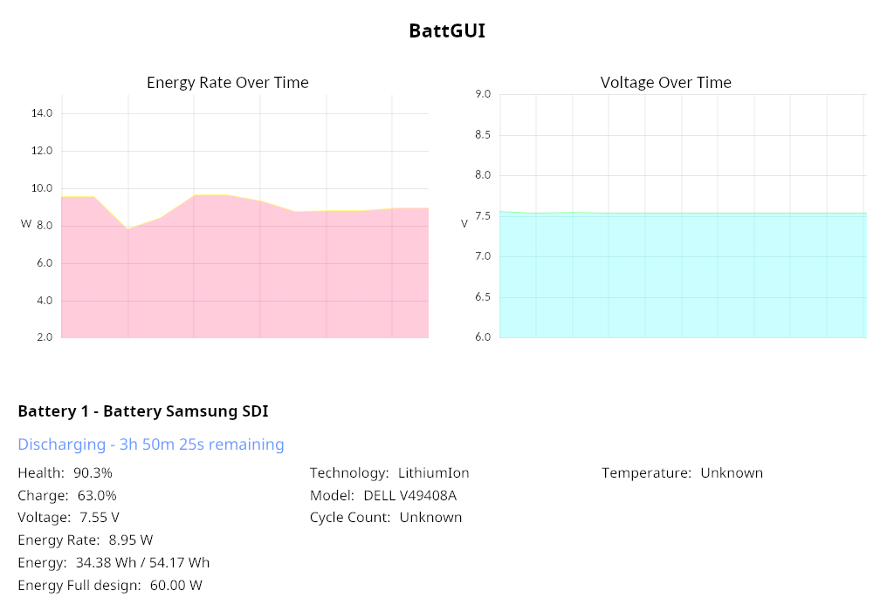

# BattGUI - Battery Monitoring Application

BattGUI is a lightweight, battery monitoring application built with Rust and the Iced GUI toolkit. It provides real-time visualization and detailed information about your device's battery status.

## Features

- Real-time battery status monitoring
- Energy rate visualization with time-series chart
- Detailed battery information including:
  - Charge percentage
  - Voltage
  - Energy consumption rate
  - Energy capacity
  - Temperature
  - Charging/discharging status
  - Time remaining estimation
  - Battery technology and model details
  - Cycle count (where available)

## Screenshot



## Installation

### Prerequisites

- Rust and Cargo (1.60.0 or newer recommended)

### Building from Source

1. Clone the repository:

   ```
   git clone https://github.com/LucaZH/battgui.git
   cd battgui
   ```

2. Build the application:

   ```
   cargo build --release
   ```

3. Run the application:
   ```
   cargo run --release
   ```
